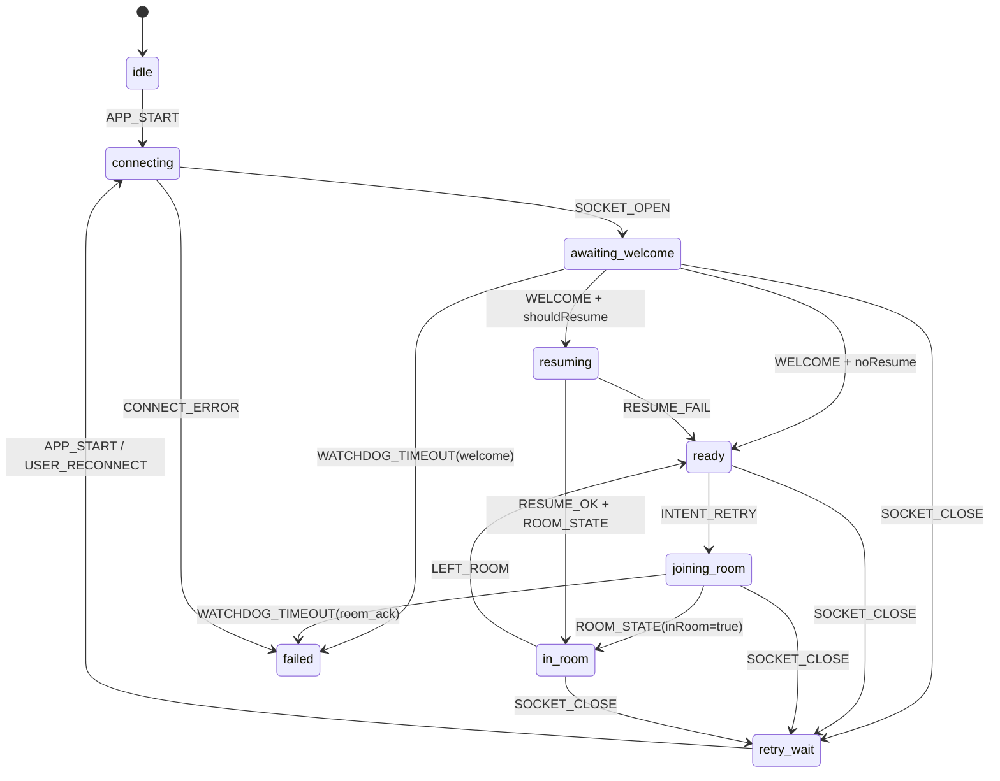

# battle 连接状态机（launch/auth/room_ack/reconnect）

本文描述 `src/client/js/connection.js` 与 `src/client/js/connection-state-machine.js` 的对齐关系，目标是让连接链路“可观测、可回滚、可压测”。

## 状态定义

- `idle`: 初始态，尚未发起连接。
- `connecting`: 正在创建 WebSocket。
- `awaiting_welcome`: socket 已打开，等待服务端 `welcome`。
- `resuming`: 检测到历史会话后正在 `resume_session`。
- `ready`: 连接可用，但未进入房间。
- `joining_room`: 已发出 `create/join/resume` 入房意图，等待 `room_state`。
- `in_room`: 已获得房间快照并进入房间。
- `retry_wait`: 断线后退避重连等待。
- `failed`: watchdog 或连接错误导致当前链路失败。

## 事件定义

- `APP_START` / `USER_RECONNECT`
- `SOCKET_OPEN` / `SOCKET_CLOSE` / `CONNECT_ERROR`
- `WELCOME`
- `INTENT_RETRY`
- `ROOM_STATE`
- `RESUME_OK` / `RESUME_FAIL`
- `WATCHDOG_TIMEOUT`
- `LEFT_ROOM`

## 状态流（核心链路）

## 实现约束

- `connection.js` 仍保持向后兼容行为；状态机接入用于统一状态语义与诊断，不改变协议字段。
- `GPP.getConnectionDiagnostics()` 暴露：
  - `machineState`
  - `machineLastEvent`
  - `launchFlow`
  - `connection`
- watchdog 只用于异常检测，不再主导正常快路径节奏。

## 回归关注点

- AI 快路径：`welcome -> INTENT_RETRY -> room_state` 不等待 `auth_state`。
- 断线恢复：`SOCKET_CLOSE -> retry_wait -> reconnect -> welcome -> resume`。
- 入房失败：`room_ack` 超时和 join 错误码必须可区分。
